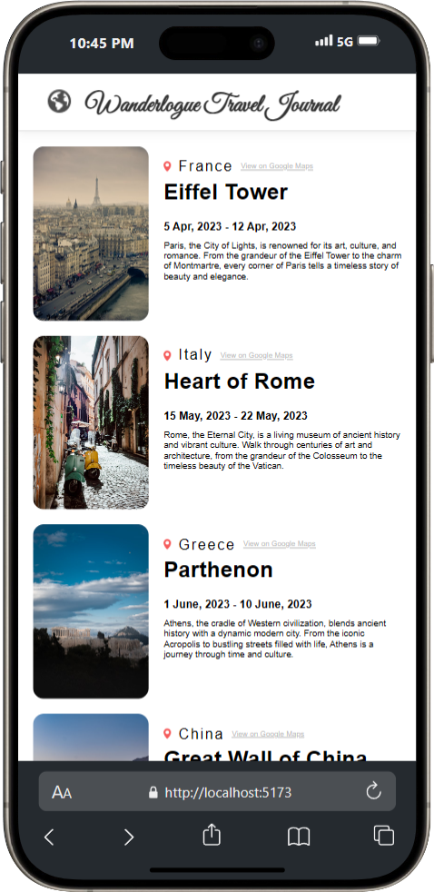
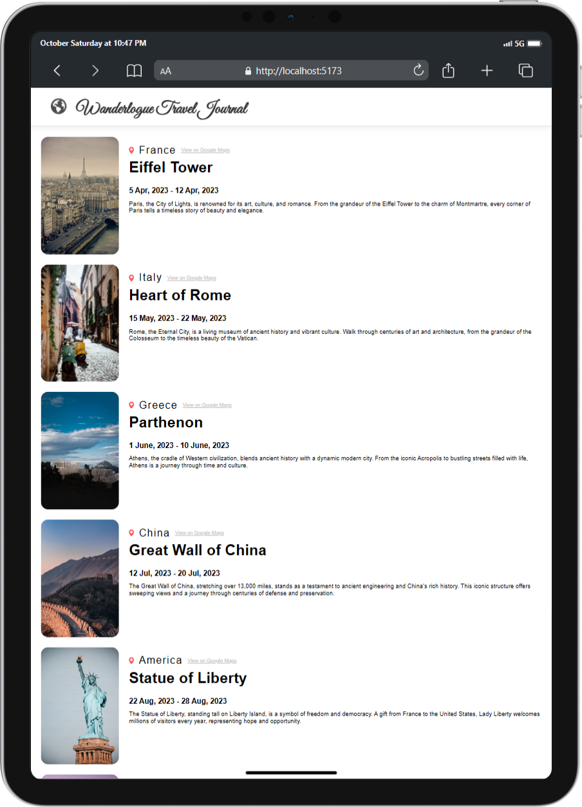

# **Wanderlogue**

## **Table of Contents**
- [Project Overview](#project-overview)
- [Features](#features)
- [Installation](#installation)
- [Usage](#usage)
- [Technologies Used](#technologies-used)
- [Screenshots](#screenshots)
- [License](#license)

## **Project Overview**
Wanderlogue is a curated journey through the world’s most captivating destinations. This project captures the beauty, wonder, and essence of travel, one story at a time. From hidden gems to iconic landmarks, this journal is your gateway to discovery and adventure. Whether you're looking for inspiration or reliving memories of past trips, Wanderlogue has something for every traveler.

## **Features**
- Interactive, user-friendly interface for exploring captivating travel stories.
- Dynamic content showcasing various destinations, from hidden gems to iconic landmarks.
- Mobile-first responsive design, optimized for all screen sizes.
- Modular and customizable design for adding new destinations and stories easily.

## **Installation**
- Clone the repository.
- Navigate to the project directory: `cd wanderlogue-frontend`
- Run `npm install` to install required dependencies.
- Run `npm run dev` to launch the development server.

## **Usage**
- Use the development server to view Wanderlogue locally in your browser.
- Explore travel destinations, read stories, and immerse yourself in the beauty of different cultures.
- You can extend the project by adding new stories or customizing the UI components within the `src` folder.

## **Technologies Used**
-  - Structure and markup of the web pages.
-  - Styling for layout and design.
-  - Logic for dynamic interactivity.
-  - Frontend framework for UI.
-  - Tool for fast frontend development and build.

## **Screenshots**

|  |  | .png) |
|:-------------------------------------------------------------------------:|:------------------------------------------------------------:|:------------------------------------------------------------------------------:|
| Wanderlogue on iPhone 15 Pro Max                                          | Wanderlogue on iPad                                          | Fullscreen View on iPhone 15 Pro Max                                           |

## **License**
This project is licensed under the MIT License - see the [LICENSE](LICENSE) file for details.

